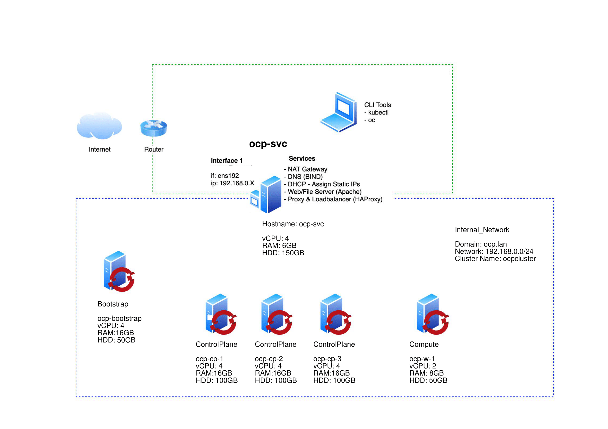

# OpenShift 4 Vsphere Installation - User Provisioned Infrastructure
- [OpenShift 4 Vsphere Install - User Provisioned Infrastructure](#openshift-4-Vsphere-install---user-provisioned-infrastructure-upi)
  - [Architecture Diagram](#architecture-diagram)
  - [Required OS images and Softwares](#Required-OS-images-and-Softwares)
  - [Prepare the Vsphere environment](#prepare-the-vsphere-environment)
  - [Configure Environmental Services](#Configure-Environmental-Services)
  - [Source Code directory structure](#Source-Code-directory-structure)
  - [Configure and Deploy OCP cluster using Installer script](#Configure-and-Deploy-OCP-cluster-using-Installer-script)
  - [Check the Cluster state](#Check-the-Cluster-state)

## Architecture Diagram


## Required OS images and Softwares
1. Download Ubuntu 18 x86_64 iso image.

1. Login to [RedHat OpenShift Cluster Manager](https://cloud.redhat.com/openshift)

1. Select 'Create Cluster' from the 'Clusters' navigation menu

1. Select 'RedHat OpenShift Container Platform'

1. Select 'Run on Vsphere'

1. Download the following files:
   - Pull secret
   - Command Line Interface for Linux and your workstations OS
   - Red Hat Enterprise Linux CoreOS (RHCOS) image. Rename them to rhcos-(version).iso. Example: "rhcos-4.7.iso" and "rhcos-4.6.iso". Need to store them in Vsphere account datastore under directory **ISOS**.
     - https://mirror.openshift.com/pub/openshift-v4/amd64/dependencies/rhcos/4.7/latest/rhcos-4.7.7-x86_64-live.x86_64.iso
     - https://mirror.openshift.com/pub/openshift-v4/amd64/dependencies/rhcos/4.6/latest/rhcos-4.6.8-x86_64-live.x86_64.iso

1. Download the following files after Ubuntu machine is setup (Jump Box machine)
   - govc
     * https://github.com/vmware/govmomi/releases/download/v0.26.0/govc_Linux_x86_64.tar.gz
   - packer
     * https://webme.ie/how-to-install-packer-on-ubuntu-18-04/

## Prepare the Vsphere environment 
1. Copy the Ubuntu 18.04 x86_64 iso image to an ESXi datastore under **ISOS** directory. If directory is not available, please create it.

1. Create a new Port Group called 'internal-network' under Networking.

## Configure Environmental Services
1. Spin up a Ubuntu VM instance.
   - HostName: ocp-svc
   - 4vcpu
   - 4GB RAM
   - 120GB HDD
   - NIC1(192) connected to the internal_network network
   - Load the Ubuntu iso image into the CD/DVD drive
   - Optionally you can install the 'Guest Tools' package to have monitoring and reporting in the VMware ESXi dashboard
   
1. SSH to the ocp-svc vm
   ```bash
   ssh root@{ocp-svc_IP_address}
   ```
1. Extract Client tools and copy them to `/usr/local/bin`

   ```bash
   tar -xvf openshift-client-linux.tar.gz
   mv oc kubectl /usr/local/bin
   ```
1. Confirm Client Tools are working

   ```bash
   kubectl version
   oc version
   ```
1. Update Ubuntu so we get the latest packages for each of the services we are about to install

   ```bash
   sudo apt-get update -y
   ```
1. **OPTIONAL**: Create a file '~/.vimrc' and paste the following (this helps with editing in vim, particularly yaml files):

   ```bash
   cat <<EOT >> ~/.vimrc
   syntax on
   set nu et ai sts=0 ts=2 sw=2 list hls
   EOT
   ```
   Update the preferred editor
   ```bash
   export OC_EDITOR="vim"
   export KUBE_EDITOR="vim"
   ```
1. Set a Static IP for internal_network network interface `ens192`. Example shared below.
   - **Address**: 192.168.0.13
   - **DNS Server**: 127.0.0.1
   - **Search domain**: ocp.lan
   - Automatically connect
   
1. Install and configure BIND DNS

   Install
   ```bash
   apt-get install bind bind-utils -y
   ```
   Apply configuration. Can refer the below listed files. 
   ```bash
   ~/openShift-automation/helper/named.conf
   ~/openShift-automation/helper/db.ocp.lan
   ~/openShift-automation/helper/db.reverse
   ```
   Enable and Start the service
   ```bash
   systemctl enable bind9
   systemctl start bind9
   systemctl status bind9
   ```
   At the moment DNS will still be pointing to the LAN DNS server. You can see this by testing with `dig ocp.lan`.  Confirm dig sees the correct DNS results by using the DNS Server running locally.
   
   ```bash
   dig ocp.lan
   dig -x 192.168.0.50
   ```
1. Install & configure DHCP
   
   Install the DHCP Server
   ```bash
    sudo apt install isc-dhcp-server -y
    ```
   Refer the dhcpd.conf (openShift-automation/helper/dhcpd.conf) to have the correct mac address for each host.
   ```bash
   ~/openShift-automation/helper/dhcpd.conf
   ```
   Enable and start the service
   ```bash
   systemctl enable dhcpd
   systemctl start dhcpd
   systemctl status dhcpd
   ```
1. Install & configure Apache Web Server

   Install Apache
   ```bash
   sudo apt install apache2 -y
   ```
    Enable and start the service
   ```bash
   systemctl enable apach2
   systemctl start apache2
   systemctl status apache2
   ```
   Making a GET request to localhost on port 80 should now return the default Apache webpage
   ```bash
   curl localhost:80
   ```
1. Install & configure HAProxy

    Install HAProxy
   ```bash
   sudo apt install haproxy -y
   ```
   Refer HAProxy config to configure loadbalancer settings.
   ```bash
   ~/openShift-automation/haproxy.cfg
   ```
   Enable and start the service
   ```bash
   systemctl enable haproxy
   systemctl start haproxy
   systemctl status haproxy
   ```
### Generate SSH Keypair
Generate an SSH key pair keeping all default options
   ```bash
   ssh-keygen
   ```
### Create ocp4 apache server directory
Create ocp4 apache server directory for storing ignition files, rhcos images etc.
   ```bash
   mkdir -p /var/www/html/ocp4
   ```
## Source Code directory structure
There will be 4 directories present under **openshift-installer-pkg**
	* **bin** : Contains binaries like packer, govc for infrastructure provisioning
	* **config**: Contains configuration file. User needs to fill it with all required values.
	* **helper**: Contains helper scripts like cleanup and cidr to ip address conversion and other configuration files.
	* **src**: Contains all source code scripts for configuration and installation.

	Package files:
	- openShift-automation/bin/govc
	- openShift-automation/bin/packer
	
	- openShift-automation/config/config.ini : contains user configuration parameter.
	
	- openShift-automation/helper/cidr-to-ip.sh : get valid IPs from subnet provided
	- openShift-automation/helper/cleanup.sh : This cleans up all OCP cluster VM's
	- openShift-automation/helper/named.conf: DNS service configuration file
	- openShift-automation/helper/db.ocp.lan: Forward resolution configuration
	- openShift-automation/helper/db.reverse: Reverse resolution configuration
	- openShift-automation/helper/dhcpd.conf: DHCP service configuration file
	- openShift-automation/helper/haproxy.cfg: HAProxy service configuration file
	
	- openShift-automation/src/configuration.sh : get configuration parameters from config.ini
	- openShift-automation/src/installer_script.sh: main script to deploy entire cluster
	- openShift-automation/src/live: This directory contains files which are generated at runtime by installer scripts.
	- openShift-automation/src/live/ocp-bootstrap.json
	- openShift-automation/src/live/ocp-cp-1.json
	- openShift-automation/src/live/ocp-cp-2.json
	- openShift-automation/src/live/ocp-cp-3.json
	- openShift-automation/src/live/ocp-install
	- openShift-automation/src/live/ocp-w-1.json
	- openShift-automation/src/template: This directory contains templates files
	- openShift-automation/src/template/install-config.yaml
	- openShift-automation/src/template/packer_vm_jsons

------------

## Configure and Deploy OCP cluster using Installer script
- Installer script will take input from config.ini file and would create ocp-install directory, copy install-config.yaml file to it. 
- It creates manifests, ignition and auth files depending upon the provided configuration and then it copies the files present in **ocp-install** directory to the apache server directory /var/www/htlml/ocp4. 
- It then ultimately creates OCP VM's. then innstall Openshift cluster, makes controlplane node schedulable, join worker nodes and delete the bootstrap node, which isn't required after cluster creation.

	Configure the **config.ini** file present at openShift-automation/config/. Fill all the required details.
 ```bash
   ~/openShift-automation/config/config.ini
   ```
config.ini example 
 ```
VCENTER=17.10.10.12
VCENTERHOSTNAME='hostname'
USERNAME='************'
PASSWORD='************'
DATACENTER=Datacenter
DEFAULTDATASTORE=datastore1
FOLDER="/Datacenter/vm/Infrastructure"
CLUSTERNAME="ocpcluster"
OCPVERSION="4.7"
NETWORKTYPE="OpenShiftSDN"
PULLSECRET='PULL-SECRET'
SSHKEY="SSH-KEY"
VCENTER_CLUSTER="ocpcloud"
VCENTER_HOST="2.24.62.33"
VCENTER_ISO_PATH="ISOS/rhcos-$OCPVERSION.iso"
SUBNET_RANGE="192.168.0.0/24"
DOMAIN_NAME="ocp.lan"
PORT_GROUP="internal_network"
JB_PASSWORD="PASSWORD"
```
### Execute the command to Create Openshift cluster 
   ```bash
   cd ~/openShift-automation/src/
   bash installer_script.sh
   ```
### Installer script would create nodes with following configuration

	3 Control Plane virtual machines:
   	- Name: ocp-cp-# (Example ocp-cp-1) - **controlplane nodes are schedulable**
   	- 4vcpu
   	- 16GB RAM
   	- 120GB HDD
   	- Thin Provisioning
   	- NIC connected to the internal_network network
	
	1 Worker node (worker nodes count is configurable) with minimum settings:
   	- Name: ocp-w-# (Example ocp-w-1)
   	- 4vcpu
   	- 8GB RAM
   	- 50GB HDD
   	- Thin Provisioning
   	- NIC connected to the internal_network network
	
	Bootstrap node (this will be deleted once installation completes) with minimum settings:
   	- Name: ocp-boostrap
   	- 4vcpu
   	- 16GB RAM
   	- 50GB HDD
   	- Thin Provisioning
   	- NIC connected to the internal_network network
	
## Check the Cluster state
	- oc get nodes - All the nodes should be in Ready state
	- oc cluster-info - apiserver info should be available
	- oc get pods -A - Check state of all the pods
